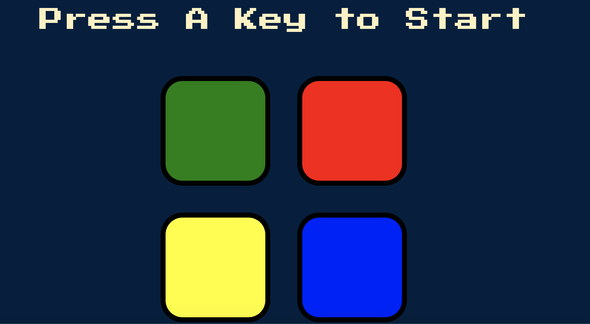

# Sound-Memory-Game
(HTML, CSS, JS, Jquery)
How to play:
When the user press a key, a sound is heard.
The user must repeat the sound sequence as it levels up.
As you progress to higher levels, the patterns get more complicated!

Play here: [Sound-memory-game](https://9geun9geun.github.io/sound_memory_game/)

 
